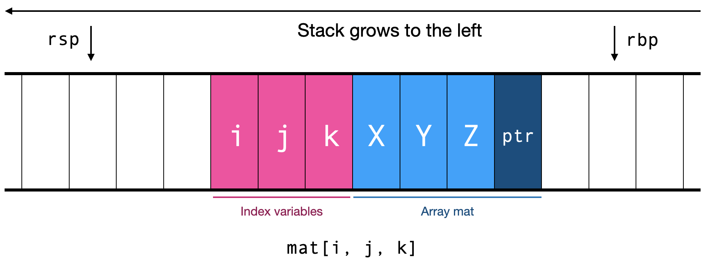
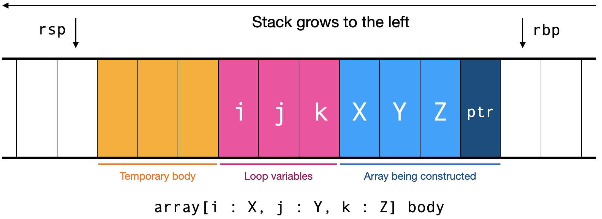
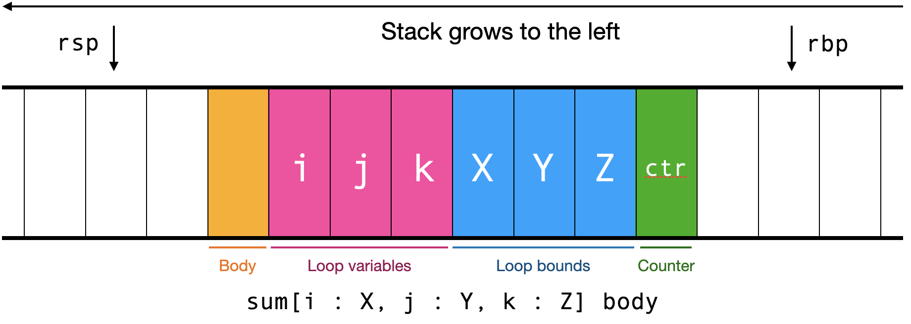

x86_64 Assembly Handbook for your JPL compiler
----------------------------------------------

This document describes everything you need to know about assembly and
low-level programming to generate code for your JPL compiler.

# Assembly tools

This section has short tips on how to work with assembly code.

## Compiling and running

You will be using an assembler called NASM. We picked this assembler
because it is user-friendly (compared to other assemblers) and
cross-platform. It has [nice tutorials][tutorial] and a [comprehensive
manual][manual].

[tutorial]: https://cs.lmu.edu/~ray/notes/nasmtutorial/
[manual]: https://nasm.us/doc/nasmdoc0.html

You can assemble some assembly code like this:

    nasm -fXXX code.s

Here, `XXX` is the name of your object file format. On Linux or WSL,
that'll be `elf64`, on macOS `macho64`, and on native Windows `win64`.
*Don't forget the "64".* Assembling produces a `code.o` object file.
You then need to link it, like this:

    ld code.o runtime.a -lpng -lm

The `runtime.a` in this case is the compiled JPL runtime, [provided
separately][runtime], and you can use `clang` or `gcc` instead of `ld`
if you don't have an `ld` command. Consult the JPL runtime
documentation for more details.

[runtime]:https://github.com/utah-cs4470-sp23/runtime 

This command will produce a file called `a.out`, short for "assembler
output". (Even though it is not actually output by your assembler...)
You can run that file:

    ./a.out

Here are some common error messages:

- `impossible combination of address sizes`: You forgot the "64" at
  the end of your NASM format flag. It should be, for example, `elf64`
  not `elf`.
- `symbol ... not defined`: You need to add an `extern` declaration
  for that function in the runtime.

It should run! If it doesn't, you'll need to debug. That will be hard.

## Debuggers

One way to do that is with a debugger like GDB or LLDB. You'll likely
need to install those separately; once you do, you can run:

    gdb ./a.out

This puts you in the debugger console. Debuggers have a *lot* of
features, but here are the most important ones for navigating through
a program's execution:

- The `b jpl_main` command sets a "breakpoint" at the start of the
  `jpl_main` function. This means your process will stop right before
  it executes the first instruction in `main`, and let you examine the
  state. You can likewise put in a different function name if you want
  to pause there.
- The `run` command runs the program, stopping at the first
  breakpoint. The `continue` command is similar, it unpauses the
  program and runs until the next breakpoint.
- The `stepi` command runs one x86_64 instruction.
- The `nexti` command runs one x86_64 instruction, unless that
  instruction is a `call`, in which case it runs until that call
  returns. (You might be familiar with "step over"; that's what this
  does.)
   
While the program is paused, you can look at its state. There are two
important commands here:

- The `p` command prints a register's value. For example, `p $rsp`
  prints the contents of the register RSP. You can change the format
  using a slash and a format specifier; for example, `p/x $rsp` prints
  the contents of the register RSP as hexadecimal. Other format
  specifiers include `d` for decimal integers, `f` for floating-point,
  and `s` for null-terminated ASCII strings.
- The `x` command prints the contents of memory. Its argument is an
  address. For example, `x $rsp` prints the contents of memory
  starting at RSP; in other words, it prints the (first part of) the
  stack. Like `p`, it takes a format specifier. You can also pass a
  number in front of a format specifier if you want to read multiple
  of that format; for example, `x/2f $rsp` prints the top two
  values on the stack as floating-point numbers.

Keep in mind that both tools use a different assembly syntax. You'll
figure most of the differences out on your own, but you may be
surprised to learn that they swap the arguments, with the destination
register coming last. Both allow you to configure the assembly syntax
if you'd like.

Here is the [GDB documentation][gdb-docs] and [LLDB
documentation][lldb-docs]. Various GUI front-ends for GDB are
available if you prefer a non-command-line debugging environment. Here
are some quick tutorials on using the assembly-relevant parts of GDB:

[gdb-docs]: https://www.gnu.org/software/gdb/documentation
[lldb-docs]: https://lldb.llvm.org/use/tutorial.html

- https://www.cs.umb.edu/~cheungr/cs341/Using_gdb_for_Assembly.pdf
- https://www.cs.swarthmore.edu/~newhall/cs31/resources/ia32_gdb.php
- https://web.cecs.pdx.edu/~apt/cs491/gdb.pdf

Here are some common assembly bugs:

- If you see `stack_not_16_byte_aligned_error` or an `E_BAD_ACCESS`,
  especially somewhere inside a system library, your stack size must
  be a multiple of 16 bytes before you call another function. Make it
  a little bigger to make it a multiple of 16 bytes.
- If you are trying to do something with strings, and are getting
  segmentation faults, make sure you used `lea` instead of `mov` to
  load the string constant into a register. `lea` puts the pointer of
  the string in the register, while `mov` instead copies the
  value---the first 8 characters. You can usually tell because one of
  your registers will have a lot of bytes that begin with 4 and 6
  (these are ASCII lower-case and upper-case letters).

If it's not these, ask for help.

# Syntax of Assembly Files

Your assembly files will have three sections: linkage information,
constants, and code.

## Linkage information

The linkage information consists of the `extern` and `global`
instruction. Think of `extern` like "import" and `global` like
"export". Your JPL compiler will `extern` functions like `print`,
`show`, and `fmod`, and it will `global` the `jpl_main` function.

When you `global` your `jpl_main`, do so twice, once with and once
without a prefix underscore:

    global jpl_main
    global _jpl_main
    
This will work whether or not you're on macOS, which has a weird
underscore convention. When you `extern` something, always use the
prefix underscore; our JPL runtime has been set up to make this work
on both macOS and other platforms.

## Constants

Next, your assembly file will have the line:

    section .data

Integer, floating point, and string constants are defined differently
in assembly. Here's a quick example:

    four: dq 4
    pi:   dq 3.1415926535897932384626433
    hewo: db `Hello, World!`, 0

Define integer and floating-point constants like this:

    NAME: dq VALUE

NASM will automatically convert the value to hex for you.

Define strings like this:

    NAME: db `VALUE`, 0

Here `NAME` is the name of the constant and `VALUE` is the original
value being stored. Note that for strings, you *must* include the
comma and the zero, which adds the null byte at the end. Also note
that you use backticks, not double quotes. Double quotes don't allow
backslash-escapes, while backticks do. You'll need to backslash-escape
backticks and backslashes.

## Code

The code portion of your assembly file will start with this line:

    section .text

Assembly code is a collection of functions. A function definition
looks like this:

    jpl_main:
    _jpl_main:
        <instructions here>

Naturally, you put the function's name instead of `jpl_main`. For
weird macOS reasons, always two labels for each function, one with and
one without a prefix underscore.

Your compiler should produce all of the defined functions in file
order, with `jpl_main` being last.

Inside the function body are instructions. The general form of an
assembly instruction looks like this:

    LABEL: INSTRUCTION WIDTH ARGUMENT, ARGUMENT ; COMMENT
    
Labels are optional and name locations in the binary code. (This is how
"functions" work; they are nothing more than locations in the code.)
In NASM, it's best to start labels that aren't functions with a
period. This makes them "local" to that function.

Instructions have an optional width. The width is usually inferred
from the operands so you should not need to specify it. Different
instructions have different numbers of operands, but the *destination*
register always comes first. Semicolons start a line comment.

Besides a register name, an argument can also be an "immediate" (which
in NASM you write as a decimal number) or an "indirect" location,
which refers to a memory location. The indirect location like `[rsp +
8]` refers to the memory location whose address is RSP plus 8 bytes.
x86\_64 has some very fancy addressing modes like `[rdi + 8 * rsp +
16]`, but we wont' use them. In x86\_64, at least one argument is
pretty much always a register.

Instructions come from the x86\_64 ISA. The comprehensive source is the
[Intel Manuals, Volume 2][intel-manuals], but the most convenient way
to look up an instruction is [Felix Cloutier's website][felix]. Here
are some short guides to x86\_64:

- https://khoury.neu.edu/home/ntuck/courses/2018/09/cs3650/amd64_asm.html
- http://www.cs.cmu.edu/afs/cs/academic/class/15213-s20/www/recitations/x86-cheat-sheet.pdf
- https://software.intel.com/content/dam/develop/external/us/en/documents/introduction-to-x64-assembly-181178.pdf
- https://www.cs.tufts.edu/comp/40/docs/x64_cheatsheet.pdf

If you look up information about x86\_64 online, make sure it's for
x86\_64! If it's for x86, that's probably fine too---a lot of those
websites are actually showing x86\_64 instructions, and even if
they're not, x86\_64 and x86 are very similar---typically the only
difference is that x86\_64 also does the same operations in 64 bits.
However, there's documentation out there on ARM assembly, PPC
assembly, and so on. Those will only confuse you.

When reading about assembly instruction, note that:

- If an instruction page says its argument is `r/m64` or `r64/m64`
  that means it can take either a regular register (but not an XMM
  register) or a memory location as an argument. If it says its
  argument is `xmm`, that means any `xmm` register (but not a regular
  register). If it says its argument is `imm64`, that means an
  "immediate", that is, an integer literal.
- If the manual refers to a "word", that means 16 bits. A
  "doubleword" is 32 bits. A "quadword" is 64 bits.
- If the manual refers to `RDX:RAX` or similar, that refers to a
  conceptual 128-bit integer whose first (most significant) 64 bits
  are in RDX and whose second (least significant) 64 bits are in RAX.
- If the manual refers to ZF, OF, or similar, those are references to
  specific flags, bits in the RFLAGS register.
- Each instruction has a half-dozen different forms, usually because
  it might support an argument that is a immediate or a register or a
  memory location, or because it might allow the same operation to
  happen at different widths, or similar. Typically, the instruction
  basically behaves the same in all variants, and the assembler will
  automatically infer which variant to use based on the arguments you
  supply. If you supply something impossible, it will complain.
- Some instructions have multiple names; for example, the
  [SETcc][setcc] instruction is one instruction but has variants like
  `SETLE`, `SETEQ`, and so on, depending on what comparison operation
  you want to do. You can tell because the instruction name will have
  lower-case letters.

[intel-manuals]: https://www.intel.com/content/www/us/en/developer/articles/technical/intel-sdm.html
[felix]: https://www.felixcloutier.com/x86/
[setcc]: https://www.felixcloutier.com/x86/setcc

# The x86 Registers and Memory Layout

x86_64 CPUs have 16 integer registers and 8 floating point registers
that you can access directly. All are 64 bits wide. We will be using
them like this:

- `rsp`: The stack pointer, which delimts the end of the stack
- `rbp`: The base pointer, which delimits the start of the stack
- `rax`: The register containing integer return values and which we'll
  use as the main register for various stuff
- `r10`, `r11`: Other registers that we'll use
- `r12`: We'll use this to store a pointer to the global frame
- `xmm0` through `xmm7`: Floating-point registers

On x86_64 the top of the stack is pointed to by `rsp`. Generally
speaking `rbp` is used to point to the other end of the current stack
frame (the part of the stack that's for the currently executing
function). Usually local variables are referenced relative to `rbp`.
The stack grows *down*, so `rsp <= rbp` and you *subtract* from `rsp`
to add more to the stack.

The RSP and RBP registers are callee-saved, meaning each function has
to save and restore them, like so:

    function:
    _function:
    	push    rbp
    	mov     rbp, rsp
        ...
	    pop     rbp
	    ret

The R12 register is also callee-saved, so in the `jpl_main` function
we'll need to save it like so:

    jpl_main:
    _jpl_main:
    	push    rbp
    	mov     rbp, rsp
        push    r12
        mov     r12, rbp
        ...
        pop     r12
	    pop     rbp
	    ret

In other functions, we just won't touch R12, so we won't need to save it.

The RAX, R10, R11, and other registers we use are caller-saved,
meaning that when you call a function, you should assume that those
registers have been wiped.

# Instructions

## Pushing and popping

Then you can push RAX on the stack like so:

    push rax
    
You can pop an integer or boolean value from the stack into RAX like
so:

    pop rax

There's no way to pop a floating-point value from the stack into an
XMM register, so you have to do this:

    movsd xmm0, [rsp]
    add   rsp, 8

Similarly, there's no instruction to push XMM onto the stack, but you
can do:

    sub   rsp, 8
    movsd [rsp], xmm0

Recall that subtracting from RSP *grows* the stack and that adding to
RSP *shrinks* the stack.

If you have two arguments, you can pop one into `rax` and one into
`r10`, or one into `xmm0` and one into `xmm1`; we'll always put the
left operand into `rax` and the right operand into `r10`.

Sometimes we need to reserve stack space without putting anything in
it, for example in order to call a function that returns a struct.
That uses a plain `sub`:

    sub rsp, 24 ; Reserve 24 bytes

Similarly we can drop values from the stack if we no longer need them:

    add rsp, 8  ; Drop 8 bytes
    
When calling functions, the stack must be aligned to a multiple of 16
bytes, which we do by reserving padding bytes and then later dropping
them.

## Copying data

You can load an integer, boolean, or floating-point constant into RAX
like so:

    mov rax, [rel NAME]

Here `NAME` is the constant's name. You might want to add a comment
with the constant's value as well. Note that floating-point constants
can be loaded into RAX, you just can't do floating-point math there.

You can load a local or global variable like so:

    mov rax, [rbp - 16]

We will always refer to variables as offsets to RBP (or R12 for global
variables) and intermediate values on the stack as offsets to RSP,
though this is convention only. Note that in `jpl_main`, we refer to
local variables (which are also global) relative to RBP.
    
To move things in memory, for example to move a local variable to the
stack, we copy via the R10 register, ending up with a sequence like
this:

    mov r10, [rsp + 16]
    mov [rax + 16], r10
    mov r10, [rsp + 8]
    mov [rax + 8], r10
    mov r10, [rsp + 0]
    mov [rax + 0], r10

This copies 24 bytes from `[rsp]` to `[rax]` via `r10`. Note that we
do the copy backwards---the furthest bytes first. This is because we
will typically copy "up" the stack, and copying the highest bytes
first means we won't overwrite our input with our output.

## Arithmetic

You can negate an integer with:

    neg rax

You can negate a boolean with:

    xor rax, 1

There's no instruction to negate a float, and many good ways to do so.
We'll use the following ugly-but-clear method:

    pxor  xmm0, xmm0
    subsd xmm0, xmm1

Note that here we require the argument to be in XMM1, not XMM0. The
result ends up in XMM0.

You can add, subtract, or multiply integers with:

    add  rax, r10
    sub  rax, r10
    imul rax, r10

These operations handle overflow in exactly the way JPL expects.

You can add, subtract, and multiply floats with:

    addsd xmm0, xmm1
    subsd xmm0, xmm1
    mulsd xmm0, xmm1
    
Dividing and modulus is harder. You divide and modulus integers like
so:

    ; Numerator RAX
    cqo
    idiv r10

This is a bit confusing. The left operand is expected in RAX. However,
`idiv` considers its input RDX:RAX, a 128-bit number; the `cqo`
instruction zeros out RDX (or makes it -1 if RAX is -1). Then, we
divide by the denominator, R10; note that RAX is not mentioned. The
result of the division is stored in RAX, while the modulus is stored
in RDX, so in a modulus operation, you may need to:

    mov rax, rdx

When doing an integer division or modulus, you need to check whether
the denominator is zero. Do so like this:

    cmp r10, 0
    jne .BAD
    lea rdi, [rel ERROR_MESSAGE]
    call _fail_assertion
    .BAD:

This code compares the denominator, R10, to 0. If they are not equal,
it skips to the next thing (presumably a division or modulus) but if
they are equal, it loads the *address of* a string constant containing
an error message and calls the runtime's `fail_assertion`  method.

The `ERROR_MESSAGE` constant should be defined in the constant part of
the assembly file to containt a C string. The `BAD` jump should have a
unique name each time it's used.

Dividing floats is easy:

    divsd xmm0, xmm1

However, there's no instruction for float modulus, so we will call the
`math.h` function `fmod`:

    call _fmod

This functions takes two arguments in XMM0 and XMM1, and puts its
result in XMM0. You don't need to check for zero when doing float
division or modulus, because in JPL that's not an error.

## Comparisons

Comparing integers and booleans is easy; it always takes this form:

    cmp   rax, r10
    setXX al
    and   rax, 1

Here the `XX` refers to one of six instructions: `SETL`, `SETG`,
`SETLE`, `SETGE`, `SETE`, or `SETNE`. The names should make it obvious
what they do.

This sequence of instructions can be a little obscure. First, we
compare RAX and R10; this doesn't modify either of them, but it sets
the flags. Then the `SETcc` operation sets the low 8 bits of RAX to
either 1 or 0. But since we can't rely on the top 56 bits all being
zero, we do a bitwise and with the constant 1, which zeros out all of
the other bits. The result is that RAX is either 0 or 1. For
operations on booleans, you wouldn't need the `and` instruction, since
in this case RAX is known to be either 0 or 1, but it's convenient to
share code between integer and boolean operations so we keep it.

Comparing floating-point values is harder. The sequence of
instructions looks like this:

    cmpltsd xmm0, xmm1
    movq    rax, xmm0
    and     rax, 1
    
Here, the `CMPccSD` instruction compares two floating-point values and
replaces the destination with either all 1 bits or all 0 bits. We then
move the destination register to `RAX` and and it with 1 to make the
result either 0 or 1. The available comparison operations are
`CMPLTSD`, `CMPLESD`, `CMPEQSD`, and `CMPNEQSD`. You might notice that
there aren't "greater than" operations; to do those, we flip the
arguments to the comparison instruction, and move the result (which is
now in XMM1) to XMM0:

    cmpltsd xmm1, xmm0
    movq    rax, xmm1
    and     rax, 1

Note that the move ends up moving XMM1, not XMM0.

## Constructing and indexing tuples

Constructing tuples is easy, because if all of the tuple parts are on
the stack in the right order, that's identical to having the tuple on
the stack instead. So a tuple constructor doesn't require any
instructions.

Indexing tuples requires determining how many bytes we want to get out
and where they are located in our input. You do this by adding up the
sizes of each field that comes earlier in the tuple. Once you know the
size and the offset, you can copy within the stack.

For example, if you have a `{int, int[], int}` tuple, and you want the
second field (the one of type `int[]`), then the full tuple takes up
32 bytes and you are looking to copy 16 bytes starting 8 bytes in. In
other words, you want to copy 16 bytes from `[rsp + 8]` to `[rsp +
16]`. The corresponding assembly would look like this:

    mov r10, [rsp + 16]
    mov [rsp + 24], r10
    mov r10, [rsp + 8]
    mov [rsp + 16], r10
    add rsp, 16
    
Note that the `add` at the end adjusts the stack---conceptually, we
popped off 32 bytes and pushed 16, leading to a change of 16.

## Constructing and indexing arrays

Constructing arrays requires first determining how many bytes you will
need to allocate on the heap, which you do by multiplying the array
size by the size of an array element. For an array literal, both of
these values are known statically, so you do the multiply at compile
time. Make sure that this multiply does not overflow! Otherwise you'd
end up accessing memory you haven't allocated.

For example, suppose you are compiling the literal `[1, 2, 3]`. This
is three elements of 8 bytes each, so 24 bytes total. So first, we
must allocate 24 bytes:

    mov  rax, 24
    call _jpl_alloc

This puts a heap pointer in RAX. Now, we need to copy 24 bytes from
the stack, at `[rsp]`, into the heap at `[rax]`, which you do using a
sequence of `mov`s. Now we need to put the array data on the stack:

    add  rsp, 24
    push rax
    mov  rax, 3
    push rax

The `add` instruction pops the 24 bytes of arguments off the stack;
then we push the heap pointer on the stack, followed by the array
size, because that is how a JPL array is laid out.

To index into an array, you must put the array on the stack first,
followed by the indices in reverse order, like so:

Note that in this arrangement, the indices (like `j`) are in the same
order as the array lengths (like `Y`) and are therefore fixed number
of bytes apart (here, 24 bytes). You can thus test each index (in
order) for being in range like so:

        mov rax, [rsp + A]
        cmp rax, 0
        jge .jump1
        lea rdi, [rel ERROR_MESSAGE_1]
        call _fail_assertion
    .jump1:
        cmp rax, [rsp + A + GAP]
        jl .jump2
        lea rdi, [rel ERROR_MESSAGE_2]
        call _fail_assertion
    .jump2:

Here, `A` starts at 0 for the first index and increases by 8 for each
index, while `GAP` is the gap between the first index and the array,
which should be `8` times the array rank. Also note that the calls to
`fail_assertion` may require padding.

Once all of the array indices are known to be valid, a pointer to that
index is constructed like so:

    mov rax, 0
    imul rax, [rsp + GAP + 0]
    add rax, [rsp + 0]
    imul rax, [rsp + GAP + 8]
    add rax, [rsp + 8]
    imul rax, [rsp + GAP + 16]
    add rax, [rsp + 16]
    ...
    imul rax, S
    add rax, [rsp + GAP + N]

Here, there is one `imul`/`add` pair for each array index, `S` is the
size of each array element, and `N` is the rank of the array. Array
indices are also be computed inside `array` loops.

After this code, the RAX register contains a pointer to the specific
array element. To read out that element, one simply needs allocate `S`
bytes on the stack and then copy `S` bytes from `[rax]` to `[rsp]`.

Alternatively, in the body of an `array` loop, one can store a value
to that index by copying from `[rsp]` to `[rax]`. In this case,
there's typically something on the stack before the indices and the
array:

In that case, the computation of the pointer into the array involves
an additional offset:

    mov rax, 0
    imul rax, [rsp + T + GAP + 0]
    add rax, [rsp + T + 0]
    imul rax, [rsp + T + GAP + 8]
    add rax, [rsp + T + 8]
    imul rax, [rsp + T + GAP + 16]
    add rax, [rsp + T + 16]
    ...
    imul rax, S
    add rax, [rsp + T + GAP + N]

Here the offset `T` is the offset to the first index; in an `array`
loop, this will be equal to size of the loop body.

# Calling functions

A function call has some number of arguments and one output. But how
exactly it is called depends on the details.

Integer and boolean arguments are passed in the registers `rdi`,
`rsi`, `rdx`, `rcx`, `r8`, and `r9`, in that order. Integer and
boolean return values are located in `rax`. So are string arguments,
because string arguments are passed as pointers.

Float arguments are passed in `xmm0`, `xmm1`, `xmm2`, `xmm3`, `xmm4`,
`xmm5`, `xmm6`, and `xmm7`. Float return values are located in `xmm0`.

In either case, extra arguments go on the stack, in reverse order.

Struct arguments are passed on the stack, so they do not require any
registers at all. Struct return values, however, mean an extra integer
passed as the first argument, in `rdi` (which contains a pointer to
where that struct must be written).

To call a function, perform the following sequence of steps:

- If there's a struct return value, allocate space for it on the stack
- Add padding so the final stack size, before the call, is a multiple
  of 16 bytes
- Compute every stack argument in reverse order (so that they end up
  on the stack in the normal order)
- Compute every register argument in reverse order
- Pop all register arguments into their correct registers
- If there's a struct return value, load its address into RDI
- Execute the `call` instruction
- Drop every stack argument
- Drop the padding, if any
- If the return value is in a register, push it onto the stack

Note that functions that return `{}` in JPL are thought of as not
returning a value at all, so for them ou neither need to allocate
stack space nor push a value onto the stack.

Most of this uses straightforward instructions. Calling the function
looks like this:

    call _FN

Note the underscore; see the [Runtime Documentation][runtime], in the
section on platform support, for details why.

[runtime]:https://github.com/utah-cs4470-sp23/runtime 

Loading the address of the struct return value looks like this:

    lea rdi, [rsp + OFFSET]

Here the offset should be equal to the total size of all of the stack
arguments plus the size of the padding.

# Control flow

## Conditionals

Conditionals are pretty simple, with a pattern that looks like this:

        ; Compute condition
        pop rax
        cmp rax, 0
        jz .ELSE
        ; Compute true branch
        jmp .END
    .ELSE:
        ; Compute else branch
    .END:

If RAX is 1, we "fall through" to the `then` branch and jump over the
`else` branch; if RAX is 2, we jump over the `then` branch and fall
through to whatever comes after.

The short-circuiting boolean operators `||` and `&&` are a kind of
conditional. They look like so, for `&&`:

        ; Compute left hand side
        pop rax
        cmp rax, 0
        je .END
        ; Compute right hand side
        pop rax
    .END:
        push rax

And for `||`:

        ; Compute left hand side
        pop rax
        cmp rax, 0
        jne .END
        ; Compute right hand side
        pop rax
    .END:
        push rax

Note that the only difference is using `je` or `jne` in the test.

## Loops

Loops involve a sequence of steps that need to be followed carefully
to generate correct code. Each loop has three parts: a prologue, a
body, and an epilogue. Both `array` and `sum` loop are pretty similar,
so in this section we describe both, noting differences.

Throughout this section, when discussing a loop like:

    array[i : X, j : Y, k : Z] body

we refer to `i`, `j`, and `k` as *loop indices*, `X`, `Y` and `Z` as
*loop bounds*, and `body` as the *loop body*.

### Loop prologue

Both `array` and `sum` loop begin by allocating 8 bytes on the stack,
and then evaluating all of the loop bounds in reverse order. For an
`array` loop, the extra 8 bytes will eventually hold a pointer to heap
data; for the `sum` loop, they will hold the running sum. Note that
for an `array` loop, the stack ends up holding, in order, the bounds
followed by a pointer, which is exactly how arrays are supposed to end
up in memory.

As each bound is computed, you must test that it is positive, like so:

    mov rax, [rsp]
    cmp rax, 0
    jg .NEXT
    lea rdi, [rel ERROR_MESSAGE]
    call _fail_assertion
    .NEXT:

As always, the `call` may require padding before and after.

Once all of the indices are computed, `[rsp + 8N]`, where `N` is the
number of indices, is the extra 8 bytes at the end of the stack. This
now has to be initialized.

For `sum` loops, initialization is easy; it just involves storing a
`0` to that location:

    mov rax, 0
    mov [rsp + 8N], rax

However, for `array` loops, initializing that value requires
allocating memory by calling `jpl_alloc`. To do that, we must first
compute how much memory to allocate. At a high level, this involves
multiplying together all of the loop bounds, which are located in
`[rsp + 0]`, `[rsp + 8]`, and so on. We also have to multiply by the
size of each array element. You might expect this code:

    mov rdi, S
    imul rdi, [rsp + 0]
    imul rdi, [rsp + 8]
    imul rdi, [rsp + 16]
    imul rdi, [rsp + 24]
    ...
    call _jpl_alloc
    mov [rsp + 8N], rax

Here, `S` is the size of each array element, and there's one `imul`
instruction for each array index. Note that we keep the running sum in
RDI, because it is intended to be used as an argument to `jpl_alloc`.
As usual, the `call` may require alignment.

_However_, this snippet is incorrect because it doesn't handle the
possibility of overflowing a 64-bit integer when computing the array
size. To handle this, each `imul` instruction needs to be be followed
by an overflow test using `jno` (Jump-if-No-Overflow):

        mov rdi, S
        imul rdi, [rsp + 0]
        jno .NEXT1
        lea rdi, [rel ERROR_MESSAGE]
        call _fail_assertion
    .NEXT1:
        imul rdi, [rsp + 0]
        jno .NEXT2
        lea rdi, [rel ERROR_MESSAGE]
        call _fail_assertion
    .NEXT2:
        ...
        call _jpl_alloc
        mov [rsp + 8N], rax

Basically, each `imul` is followed by an `jno` and an error handling
case, but the overall approach is still the same as in the simpler
snippet above.

Finally, once we've set up the running sum or array pointer, we are
almost ready to begin the loop. We need only set the loop indices to
start at 0:

    mov rax, 0
    push rax
    mov rax, 0
    push rax
    ...

Make sure to record the location of each index, in reverse order, in
your stack description so that later code can refer to the loop indices.

The result will be a stack that looks like this:

or this:

but without the body. We can now enter the loop body.

### Loop body

The loop body begins with a label, so that we can jump back to this
code at the end of the loop:

    .LOOP:

We start by computing the loop body, so that the stack looks like so:

or this:

including the loop body on top of the loop.

Now we need to do something with the loop body---store it in the array
for an `array` loop, or add it to the running sum in a `sum` loop.

For `array` loops, we need to store it into the array. To do so,
compute the pointer to the correct array index as described in the
array indexing section, and then move `S` bytes from `[rsp]` to
`[rax]`, where `S` is the size of the loop body. Make sure to free
the loop body from the stack.

For `sum` loops that are summing integers, we simply pop the body into
`rax` and add it to the counter:

    pop rax
    add [rsp + 8N + 8N], rax

Note that `[rsp + 8N + 8N]` steps over the indices and the bounds and
therefore points to the running sum.

For `sum` loops that are summing floats, there's a little more moving
data back and forth:

    movsd xmm0, [rsp]
    add rsp, 8
    addsd xmm0, [rsp + 8N + 8N]
    movsd [rsp + 8N + 8N], xmm0

This is more verbose because the destination of an `addsd` instruction
cannot be a memory location.

Finally, once we've stored / added the loop body, we have the
increment the loop indices. To do so, first increment the innermost
loop index:

    add qword [rsp + 8N - 8], 1

Next, we need to test that this loop index is in range. If it's not in
range, we need to set it to zero and increment the next loop index:

    mov rax, [rsp + 8I]
    cmp rax, [rsp + 8I + 8N]
    jl .LOOP
    mov qword [rsp + 8I], 0
    add qword [rsp + 8I - 8)], 1

Here `I` starts at `N` and decreases by `8` over and over again to go
through the loop indices in reverse order. The first two instructions
check the current loop index `[rsp + 8I]` against its loop bounds
`[rsp + 8I + 8N]`. If it is less than the loop bound, we can move on
to the next iteration. If it is greater, we need to reset it to zero
and increment the next loop index `[rsp + 8I - I]`. We then repeat the
process with the next loop index, and the next one, and so on.

When `I` is zero, meaning we are on the outermost loop index, there's
no next index to increment:

    mov rax, [rsp + 0]
    cmp rax, [rsp + 0 + 8N]
    jl .LOOP
    
Note that if the `jl` doesn't fire, meaning the outermost loop index
has reached its maximum, we simply fall through to the loop epilogue.

### Loop Epilogue

Now that the loop is over, we free all of the loop indices:

    add rsp, 8N

The stack now contains the loop bounds and the extra 8 bytes
containing either the heap pointer (`array` loops) or the running sum
(`sum` loops).

For an `array` loop, the loop bounds plus the heap pointer are the
representation of an array, so we are done.

For a `sum` loop, we only need the running sum, not the loop bounds,
so we free the loop bounds:

    add rsp, 8N

That's it!

# Commands and Statements

You don't generate any code for type definitions.

For `print` commands, load the address of the string like this:

    lea rdi, [rel NAME]

Here `NAME` is the name of the string constant. After loading the
address, align the stack, call `print`, and unalign the stack.

For `show` commands, align the stack, then load the address of the
type description like above, then load the address of the stack like
so:

    lea rsi, [rsp]

Call `show`, drop the argument, and unalign the stack.

For the `read` command, make room for the return value, align the
stack, load the address of the stack into RDI and the address of the
filename like above, call `read_image`, and unalign the stack.

For the `write` command, align the stack, compute the argument, and
load the address of the filename into RDI. Then call `write_image`,
drop the argument, and unalign the stack.

For a `let` command, just compute the argument and reclassify it as
local variable by storing its (negative) offset to RBP.

For the `assert` command, generate exactly the same code as you did to
test whether the denominator of a division or modulus operation is
zero.

`time` commands are tricky. First, you will want to call the
`get_time` function (pushing its return value on the stack). Then you
want to run the command being timed. Then, call `get_time` again,
again pushing its return value on the stack. Now:

- Pop the result of the second call into XMM0
- Copy the result of the first call ingo xmm1
- Subtract
- Align the stacks
- Call `print_time`

In the case that there's no alignment, it'll look something like this:

    call  _get_time
    sub   rsp, 8
    movsd [rsp], xmm0

    ; Run the wrapped command, say it allocates 24 bytes on the stack

    call  _get_time
    sub   rsp, 8
    movsd [rsp], xmm0

    movsd xmm0, [rsp]
    add   rsp, 8
    movsd xmm1, [rsp + 24]
    subsd xmm0, xmm1
    call  _print_time

Note that pushing the result of the second call, and then immediately
popping it, is pretty wasteful, but our compiler will do it in order
to save code.

# Function definitions

Function definitions always start with the preamble:

    push rbp
    mov  rbp, rsp

If the function returns a struct, push the address to write the return
value into on the stack:

    push rdi

Then, for each argument:

- If it's a stack argument, just record its offset, which will be a
  positive offset to `rbp` because it was pushed on the stack by our
  caller, before the start of this function's stack frame.
- If it's a register argument, push it on the stack and record its
  offset, which will be a negative offset to `rbp`.

Then compute each statement in the function. `let` and `assert`
statements behave the same as their commands, but return statements
are tricky:

- If you're returning an integer or a boolean, pop it into `rax`
- If you're returning a floating-point value, pop it into `xmm0`
- If you're returning a struct, move the saved address into RAX and
  then copy the relevant number of bytes from the stack to RAX
- If you're returning nothing, do nothing.

Then, free all of the local variables from the stack:

    add rsp, SIZE

Then add the postamble:

    pop rbp
    ret

Note that you should do this for every `return` statement. If there's
more than one, then you'll end up with multiple postambles and `ret`
instructions, but that's OK. (Later ones won't be executed).

If there's no `return` instruction at all, you'll need to add assembly
corresponding to `return {}` at the end of the function.
