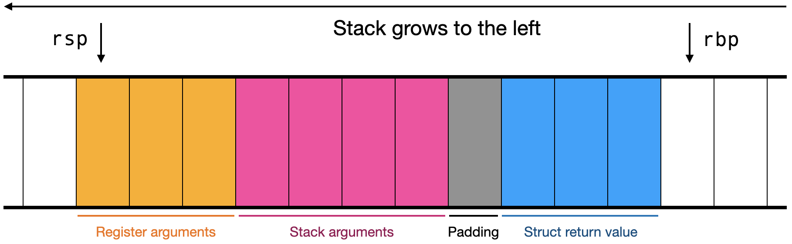
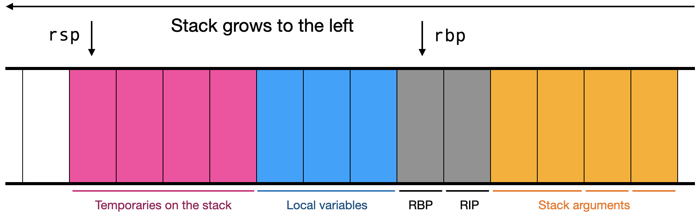

Assignment 10: Calling Conventions
==================================

For this assignment you will generate assembly code for function calls
and function definitions.
 
## Function and type definitions

In this assignment, you will add x86\_64 assembly code generation
for the following syntactic constructs:

```
cmd  : let <lvalue> = <expr>
expr : <variable>

cmd  : print <string>
     | read image <string> to <argument>
     | assert <expr> , <string>
     | type <variable> = <type>
     | write image <expr> to <string>
     | time <cmd>

expr : <variable> ( <expr> , ... )

cmd  : fn <variable> ( <binding> , ... ) : <type> { ;
           <stmt> ; ... ;
       }
stmt : assert <expr> , <string>
     | let <lvalue> = <expr>
     | return <expr>

```

As in the previous assignment, these constructos are organized into
four groups, from easiest to hardest. Consult the [JPL
specification](../spec.md) for the expected behavior of these
constructs.

As in the previous assignment, the [Assembly Handbook](../assembly.md)
contains all of the essential information needed to understand the
provided compiler's assembly code.

Your compiler must implement the `-s` flag and print `Compilation
failed` or `Compilation succeeded` when compiling. We will use this
when testing your compiler.

## Calling conventions

A *calling convention* describes how to call a function in assembly
code. Typically, it describes which arguments are passed in which
registers, and which arguments are passed on the stack, and also
various details like argument order, register saving, stack alignment,
and so on.

The JPL calling convention is as follows:

- Integral arguments are passed in the general-purpose registers, in
  the following order: RDI, RSI, RDX, RCX, R8, R9
- Floating-point arguments are passed in the vector registers, in the
  following order: XMM0 through XMM7
- Aggregate arguments, and any integral or floating-point arguments
  beyond those that fit in the registers above, are passed on the
  stack. The stack arguments are always in order on the stack, meaning
  they have to be pushed in reverse order. When the function is
  called, the top of the stack must be the first stack-passed argument.
- Integral return values are passed in RAX
- Floating-point return values are passed in XMM0
- Functions with a void return type are considered to have no return
  value
- Aggregate return values are written to the stack. The caller must
  allocate space on the stack and pass the location of that stack
  space as the first integral argument.

Here, integral arguments are JPL `int`s and `bool`s and 64-bit signed
integers (`int64_t`), strings (`char*`), and pointers (`void*`) in the
JPL runtime functions. Floating-point arguments are JPL `float`s and
64-bit double-precision values (`double`) in the JPL runtime
functions. Void return types are JPL `{}`s and `void` functions in the
JPL runtime. All other values---JPL arrays and non-empty tuples, and
`struct` values in the JPL runtime---are considered aggregates.

(Note that this is close to, but not quite identical to, the Linux
x86_64 ABI. That ABI allows passing some structs in registers in some
circumstances, though not any circumstances that come up in the JPL
runtime. The details are complex, so we've simplified a bit for JPL.)

Stacks must also be 16-byte aligned when calling a function. Our JPL
compiler assumes that any registers are overwritten during calls, so
it doesn't need to save any registers across calls. This basically
means that, to call a function, you should do the following:

- Determine which arguments are passed on the stack and which are
  passed in which registers. Do the same for the return value.
- Allocate space for an array or tuple return value, if necessary
- Add padding to align the stack, if necessary
- Evaluate all stack arguments in reverse order, so they are on the
  stack in the correct order
- Evaluate all register arguments in reverse order, so they are on the
  top of the stack
- Pop all of the register arguments into the appropriate registers, so
  that the top of the stack is now the first stack-passed argument
- Put the address of the space allocated for an array or tuple return
  value in RDI, if necessary
- Call the function

Just before you start popping register arguments, the stack should
look like this:



The point of doing things in this kind of weird order is to reduce the
number of assembly instructions needed. For example, because we place
the struct return value below the padding, that struct return value
ends up on the top of the stack once pop all of the arguments and
remove the padding. Likewise, because stack arguments are pushed
first, they are on top of the stack, like they are supposed to be,
once we've poppped all of the register arguments.

Inside a function definition, register arguments are pushed on the
stack in order, starting with the address of the space allocated for a
struct return value, if any.

Most commands involve calls to the [JPL runtime][runtime]. Read that
documentation carefully before calling a function in it. The
documentation gives the function arguments and return types (as a C
function declaration) and any other assumptions made about the
arguments, like whether strings are null-terminated.

[runtime]:https://github.com/utah-cs4470-sp23/runtime 

## Local variables

In this assignment we'll be adding support for `let` and other local
variables. We'll also be adding support for function arguments. Your
code will have to keep track of where these values are, on the stack,
so that it can use the values of variables.

Since `let` is a statement/command, it is only executed when no
temporaries are on the stack (because only expressions generate
temporaries). It then executes the right-hand side of the `let`
assignment, so that the stack contains a single temporary with value
being assigned. For simplicity, the `let` command simply leaves that
value there and remembers its location on the stack, as an offset from
RBP.

More generally, a stack frame looks like this:



The RBP and RIP entries are created by the function prologue and the
`call` instruction. To the right (lower on the stack) are the
stack-passed function arguments, with a positive offset from RBP (with
`[rbp + 16]` pointing to the first stack argument). To the left
(higher on the stack) are local variables, with a negative offset from
RBP (with `[rbp - 8]` pointing to the first local variable, if its
size is 8 bytes). Past the local variables are any temporaries for the
currently-executing expression.

JPL functions can also access global variables. Your code should
already set R12 to point to the stack frame of `jpl_main`, so you can
access global variables relative to R12. (Note that R12 is a
callee-saved register, so any JPL runtime functions that you call are
required to set it back to its original value before returning,
meaning that R12 will always have the same value throughout the
execution of your JPL program.)

When handling complex `LValue`s, like in the following assignment:

    let {{x, y}, z[W, H]} = {{1, 3.0}, array[i : 3, j : 3] 4}
    
The value on the right-hand side looks like this in memory, with a
total size of 40 bytes.

    | integer (x) | float (y) | integer (W) | integer (H) | pointer |
    |----- x -----|---- y ----|------------------- z ---------------|
    
If the offset of this value is `RBP - 64`, then `x` has an offset of
-64, `y` an offset of -56, `z` an offset of -48, `W` offset of -48,
and `H` an offset of -40.

The `jpl_main` function takes `args` and `argnum` as arguments, as if
it were defined like so:

```
fn jpl_main(args[argnum] : int[]) : {} {
    ...
}
```

Before returning from a function, you need to drop all of the local
variables off the stack, via an `add rsp, N` instruction. However, if
a function did not have any local variables, don't output such an
instruction. The provided JPL compiler adds a comment to that
instruction so that you can easily find it.

## Organizing your code generator

Continue to build on the code structure from the last assignment: an
`Assembly` object which contains multiple `Function` objects, where
each `Function` object contains `cg_` functions that take in an AST
node and a stack description, and return a list of assembly
instructions and a new stack description. (Or you might store the
stack description in a field of `Function`; that's fine too.)

Your stack description is likely currently just an integer. Replace it
with a `StackDescription` class. This class should contain an integer
stack size but also a hash table mapping local variable names to their
locations. For example, if you are compiling the command `let x = y`,
your `cg_let_cmd` function should be passed a stack description where
`y` is mapped to some location like `rbp - 16`, and should output a
stack description where both `x` and `y` are mapped to some location.

It's sufficient to store the location as an integer offset to RBP.
Save the global stack description somewhere so you can look up global
variables as well; treat those offsets as relative to R12. You can
make the `StackDescription` a subclass of `SymbolTable`, though if you
want to make it a new class, that's fine too. You don't need to store
the type of variables, or function names, or anything like that in the
`StackDescription`. You'll want to write helper methods like
`add_argument` and `add_lvalue` for the `StackDescription`. These
methods should receive an `Argument`/`LValue`, a type, and a stack
offset, and update the `StackDescription` with the right offset for
each bound variable.

When a `Function` is asked to generate code for a `type` command, it
should output no instructions and do nothing. Your type checker should
have already resolved type definitions. When a `Function` is asked to
generate code for a `fn` command, it should output no instructions,
but it should ask the `Assembly` to create a new `Function` object and
generate code for the function body inside *that* `Function`.

We recommend writing a `CallingConvention` class that stores
information about where the arguments and return values are stored for
a particular function call. The constructor for a `CallingConvention`
should take a list of `ResolvedType`s for the arguments and a
`ResolvedType` for the return value. A `CallingConvention` should
store a list of `Location`s for each argument and a `Location` for the
return value; a `Location` should be either a `Register` (which should
have a field indicating the register name) or a `StackValue` (which
should have a field containing a stack offset). You'll use
`CallingConvention`s both when calling and when defining functions.

## Stages of function support

We recommend you approach this assignment in four stages.

First, add support for `let` commands. You'll need to implement
`StackDescription` to store the offsets of function arguments. You'll
also need to write `add_argument` and `add_lvalue` to handle complex
arguments.

Second, add support for function calls. There should be plenty of
built-in functions to call. At this stage you would write the
`CallingConvention` class, though because the builtin functions don't
take aggregate arguments, you don't need to support that yet. Make
sure to test nested function calls like `sin(atan2(1.0, 2.0))`.

Third, add support for the other JPL commands. Most of these commands
call JPL runtime functions. Read the [documentation][runtime]
carefully and work out what the stack should look like to call each
one. Compare with the sequence of steps in the [Assembly
Handbook](../assembly.md) to make sure you got it right. This will
give you a good sense of how to call functions with aggregate
arguments and return values. Note that `read` commands are like `let`
commands in that they also bind variables. With `time` commands, make
sure to support constructs like `time time assert ...` correctly.

Finally, add support for function definitions. You'll need to improve
`CallingConvention` to handle of aggregate arguments and also
arguments with too many integer or floating-point arguments, because
user-defined functions can have any number of arguments in JPL. You
can use the `FunctionInfo` in the global symbol table to look up the
types of each argument. For aggregate return values, we recommend
saving its location to the `StackDescription`, perhaps as the location
of a variable named `$return` or similar. (Note that this is not a
valid JPL variable name, so you're guaranteed it won't be overwritten
by a user variable). You'll also need to implement code generation for
statements. The `assert` and `let` statements are identical to the
same-name commands, but the `return` statement is new. Also make sure
to handle implicit returns at the end of a void function.

# Testing your code

Your code will be tested against the provided JPL compiler. You will
need to update your compiler, since earlier versions did not have
compilation enabled. You can update your compiler by navigating to
your checkout of the auto-grader repository and running:

    make -C <auto-grader directory> upgrade
    
Naturally, this JPL compiler is a program and can have bugs. If you
think you've found one, contact the instructors on Discord.

Note that the auto-grader normalizes initial whitespace, newlines,
comments, float syntax, and address arithmetic before comparing
assembly files. This means you probably want to run the provided
compiler on your own instead of just using the auto-grader to figure
out what assembly you're supposed to produce. When run directly, the
provided compiler prints some comments, indents some stuff, and in
general is easier to read.

You can find the tests and expected outputs [in the auto-grader
repository](https://github.com/utah-cs4470-sp23/grader/tree/main/hw10).

The directories `ok1` (Part 1, `let`), `ok2` (Part 2, calls), `ok3`
(Part 3, commands), and `ok4` (Part 4, definitions) contain valid
hand-written JPL programs to guide you through this assignment.

The `ok-fuzzer` (Part 5) directory contains valid, auto-generated JPL
programs.

You can run these tests on your computer by downloading the
auto-grader and running it like so:

    make -C <auto-grader directory> DIR=<compiler directory> PART=<part>

We recommend trying to get each part working fully before moving on to
the next one.

# Submission and grading

This assignment is due Friday March 24.

We are happy to discuss problems and solutions with you on Discord, in
office hours, or by appointment.

Your compiler must be runnable as described in the [Testing your
code][Testing your code] section. If the auto-grader cannot run your
code, you will not receive credit. The auto-grader output is available
to you at any time, as many times as you want. Make use of it.

The rubrik is:

| Weight | Function |
|--------|----------|
| 15%    | Part 1   |
| 15%    | Part 2   |
| 20%    | Part 3   |
| 20%    | Part 4   |
| 30%    | Part 5   |

Your solutions will be auto-graded. The auto-grader will use Github
Actions and runs on Ubuntu using the tests described above.
