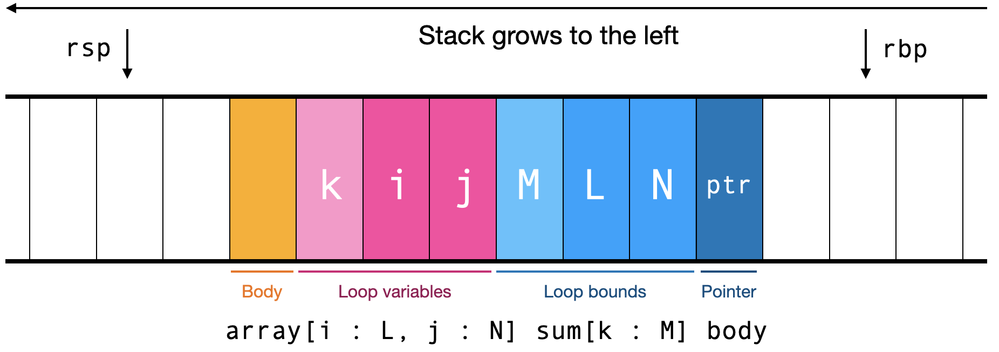

Assignment 14: Loop Permutation
===============================

For this assignment you will add a loop permutation pass to your
compiler. This pass should lead to dramatic speedups on many
real-world programs, like matrix multiplication routines or neural
network inference.
 
# What you turn in

This assignment is due Friday April 21.

Your compiler must implement the `-s` flag and the `-O` flag. Your
compiler will be called with both `-s` and `-s -O3`. When called with
`-s`, it should generate the same assembly code expected for
Assignment 11. When called with `-s -O3`, it should generate assembly
code with loop permutation, explained below. The [provided
compiler][releases] supports this flag, so you can use it for testing.

[releases]: https://github.com/utah-cs4470-sp23/class/releases

As with Assignment 11–13, none of the test cases require support
for function definitions.

In this assignment, your compiler will be evaluated on only 5 programs
total:

- A columnar sum routine
- A cross product computed via Levi-Civita symbols
- A matrix multiply routine
- A softmax neural network layer inference
- A dense feed-forward neural network layer inference

It's not important to understand what these computations are used for;
each of them loads data from images, converts them into integer or
float arrays, and then runs a tensor contraction operation on them.

Like in the prior two assignments, you are tested for matching the
assembly produced by the [provided compiler][releases], though you
don't need to match comments, whitespace, or exactly how you do
address arithmetic. The grading rubrik is:

| Tests | col | crs | mat | sft | dns |
|-------|-----|-----|-----|-----|-----|
| Grade | 10% | 20% | 20% | 20% | 30% |

All of the parts of this assignment are necessary to pass any of these
benchmarks, so we instead recommend you follow the sections of this
assignment and test each of them, as described in that section, on all
five programs.

# If you didn't do HW12 or HW13

If you didn't do HW12 or HW13, you can still pass this assignment.
However, the grader won't be quite as helpful to you.

Basically, the provided compiler implements a special mode when you
pass the flag `-O4`. In this mode, the provided compiler applies the
loop permutation optimization described here, but *not* any of the
optimizations described in HW12 or HW13.

If you produce the same output as the provided compiler at `-O4`, the
grader will pass you. *However*, the diffs printed by the autograder
only compare your compiler's output to the normal `-O3` mode where
HW12 and HW13 optimizations are turned on. This means the diffs will
not be useful to you.

If you did not complete HW12 and HW13, but still intend to complete
this homework assignment, we recommend you manually compare your
compiler's output to `*.jpl.expected.opt3only` in the auto-grader's
`hw14` directory. You would want to run something like this in the
auto-grader directory:

    make -C <your-repo> run TEST="hw14/$BENCH.jpl" FLAGS="-s -O3" |
    python3 normalize-asm.py > yours.s
    python3 normalize-asm.py < hw14/$BENCH.jpl.expected.opt3only > profs.s
    diff yours.s profs.s

This script runs your compiler (line 1), normalizes the assembly, and
saves it to `yours.s` (line 2). Then it normalizes the expected
assembly with only this assignment's optimizations, and saves that to
`profs.s` (line 3). Finally it uses `diff` to compare the two files.

# Overview

In this assignment, we are focused on expressions like the following:

    array[i : L, j : N] sum[k : M] A[i, k] * B[k, j]

Specifically: `array` loops whose body is a `sum` loop, and where both
their loop bounds are integers (or constant propagate to integers).
Moreover, the body of the inner `sum` loop can only contain binary
operations, constants, variables, and indexing into arrays. This
category of computations is called "tensor contraction" and is
essential to statistics, scientific computing, and machine learning.

We can build a *traversal graph* for a tensor contraction. Each
variable bound by the `array` or `sum` forms a node of the graph.
Every *indexing pair* of two variables forms an edge. Indexing pairs
(`i`, `j`) are created by:

- An array index expression `A[..., i, ..., j, ...]`
- An array loop expression  `array[..., i : ..., ..., j : ..., ...] ...`
- A sum loop expression `sum[..., i : ..., ..., j : ..., ...] ...`,
  but **only** if the sum is summing floating-point numbers.

The basic idea of this graph is that an indexing pair (`i`, `j`) means
that we want `j` to change more often than `i`. In an array index or
an `array` loop, that's because it means we will traverse the array in
a cache-efficient way. In a `sum` loop over floating-point values,
that's because floating-point addition isn't associative, so we can't
change the order of floating-point summations.

For example, consider matrix multiplication:

    array[i : L, j : N] sum[k : M] A[i, k] * B[k, j]
    
Here the graph nodes are `i`, `j`, and `k`, and the edges are:

- The index `A[i, k]` creates the edge (`i`, `k`)
- The index `B[k, j]` creates the edge (`k`, `j`)
- The `array[i : L, j : N] ...` loop creates the edge (`i`, `j`)

Here's another example, from a neural network inference routine:

    array[i : W, j : H] sum[i2 : W, j2 : H] input[i2, j2] * weights[i2, j2, i, j]

The edges are:

- From `input[i2, j2]`, the edge (`i2`, `j2`)
- From `weights[i2, j2, i, j]`, six edges:
  from `i2` to `j2`, `i`, and `j`;
  from `j2` to `i` and `j`;
  and from `i` to `j`
- From the `array` loop, the edge (`i`, `j`)
- From the `sum` loop, the edge (`i2`, `j2`)

Given the traversal graph, we can now create the *topological order*
of the variables. In the topological order, if there's an edge from
`i` to `j`, then `i` must come before `j` in the order. For matrix
multiplication, the only topological order is `i`, then `k`, then `j`.
For the neural network inference routine, the only topological order
is `i2`, then `j2`, then `i`, then `j`.

Finally, we want to generate code that increments the loop variables
in the topological order. Typically, the topological order isn't the
order of the variables in the program—and in this case, it's pretty
normal to see speed-ups of about 10–16× from switching to the
topological order. On a matrix multiplication routine, loop
permutation creates speedups of about 16× and results in slightly
faster code than equivalent C compiled by LLVM 16 (which does not do
loop permutation).

# Detecting tensor contractions

Our first step is detecting tensor contraction expressions. Formally,
tensor contractions must match these rules:

- It is an `array` loop, whose loop bounds are integers or constant
  propagate to integers;
- Whose body is a `sum` loop, whose loop bounds are also integers or
  constant propagate to integers;
- Whose body matches the following grammar:

```
tc : array [ <variable> : <integer> , ... ] <tc_sum>

tc_sum : sum [ <variable> : <integer> , ... ] <tc_body>

tc_body : <tc_body> <binop> <tc_body>
        | <tc_primitive> [ <tc_primitive> , ... ]
        | <tc_primitive>

tc_primitive : <integer> | <float> | <variable>
```

To identify tensor contractions, add a bunch of boolean flags to your
`Expr` class:

- `is_tc`, which will indicate if an expression matches the `tc` class
- `is_tc_sum`, which will indicate if an expression matches the
  `tc_sum` class
- `is_tc_body`, which will indicate if an expression matches the
  `tc_body` class
- `is_tc_primitive`, which will indicate if an expression matches the
  `tc_primitive` class

You should initial these fields to `false`.

Create an `ASTVisitor` called `TensorContraction` to set these
boolean flags. This should be pretty straightforward. For example,
your `visit_int_expr`, `visit_float_expr`, and `visit_var_expr`
methods should set `is_tc_primitive` and `is_tc_body`; your
`visit_binop_expr` and `visit_array_index_expr` methods should set
`is_tc_body`; and so on.

Note that, when setting `tc` and `tc_sum`, you need to check that the
loop bounds are integers. You should also allow them to be expression
that constant-propagate to an integer. For this to work, you'll need
to make sure to run the `TensorContraction` after you run the
`ConstantPropagation`.

To debug this step, we recommend adding a print statement in all of
the `TensorContraction` methods that set the various fields. Once it
works, you should be able to detect 1 tensor contraction in each of
the five benchmarks. That tensor contraction should come from the last
line of each benchmark.

# Building the traversal graph

Add two new fields to `ArrayLoopExpr` to store the traversal graph.
These should be a list of variable names for the nodes (call it
`tc_nodes`, perhaps) and a list of pairs of variable names for the
edges (maybe call it `tc_edges`).

Fill these fields in after you set the `is_tc` field on an expression.
You'll probably want to fill in `tc_nodes`, and then call a recursive
function that will traverse through the tensor contraction body to
fill in `tc_edges`.

Pay attention to the following important rules:

- `tc_nodes` should be in order, with the `array` loop variables first
  and the `sum` loop variables afterward. The order of `tc_edges`
  doesn't matter.
- Make sure to add the edges that come from the `array` and possibly
  `sum` loop as well.
- If an array index, `array` loop, or float `sum` loop have only one
  element, they don't add any edges; if they have more than two
  elements, they add many edges.
- If an array index is an integer or a variable that isn't in
  `tc_nodes`, it doesn't add any edges. Your recursive function will
  probably need to passed the `tc_nodes` list to check this.

To debug this step, we recommend printing the nodes and edges after
they're computed. The provided compiler prints the list of nodes and
edges as a comment in the assembly code, which you can compare your
list of nodes and edges to. Here's the size of each graph:

| Benchmark | Nodes | Edges |
|-----------|-------|-------|
| `col`     | 2     | 1     |
| `crs`     | 3     | 3     |
| `mat`     | 3     | 3     |
| `sft`     | 3     | 3     |
| `dns`     | 4     | 6     |

# Computing the topological order

There are lots of algorithms for topological sort. We recommend you
use the following naive algorithm, because it is easy to implement and
because performance shouldn't matter since it's rare to have tensors
with hundreds of dimensions.

The algorithm works like this:

- The topological order starts empty
- Repeat until the topological order has every node in it
- Go through the nodes one by one
- Check each node for whether it is the target of any edge
- Find a node that isn't
- Add it to the topological order
- Remove it from the node list
- Remove any edges whose source is this node
- Repeat.

For example, consider the matrix multiply traversal graph, which has
three nodes (`i`, `j`, `k`) and three edges ((`i`, `j`), (`i`, `k`),
and (`k`, `j`)):

- The topological order starts empty
- `i` isn't the target of any edge, so add it; the topological order
  is now `i`, the nodes are now `j` and `k`, and the edges are now
  `k`, `j` (because the other two edges had `i` as a source and were
  removed)
- `j` is the target of an edge, so it doesn't work
- `k` isn't the target of any edge, so add it; the topological order
  is now `i`, `k`, the nodes are now just `j`, and there are now no
  edges
- Now, `j` is not the target of any edge, so add it; the topological
  order is now `i`, `k`, `j` and the loop is done

This algorithm is O(V^2 E), since it has three nested loops. In our
case, E can be as large as V^2, so overall this algorithm is O(V^4).
This definitely isn't ideal, but would really only become a problem
once you had hundreds of variables, and hundred-dimensional tensors
are rare. Our benchmarks have four variables at most. There are
faster, O(E) algorithms for topological sort. Those algorithms are
variations of this one, but use hash tables to avoid having to
traverse the list of variables repeatedly.

We recommend debugging this step by printing the topological order,
the list of nodes, and the list of edges at every iteration of the
outer loop. All of the graphs we will be compiling are pretty small,
so it should be easy to work out by hand what went wrong. Here are the
initial orders and topological orders for each benchmark; these can
also be found in a comment in the generated assembly code:

| Benchmark | Initial Order | Topological Order |
|-----------|---------------|-------------------|
| `col`     | j, i          | i, j              |
| `crs`     | i, k, j       | i, j, k           |
| `mat`     | i, j, k       | i, k, j           |
| `sft`     | n, i, j       | i, j, n           |
| `dns`     | i, j, i2, j2  | i2, j2, i, j      |

Once you've constructed the topological order, save it on a new field
of `ArrayLoopExpr`s, perhaps called `tc_order`.

# Using the topological order

At this stage, the `TensorContraction` pass is done, and it's time to
use this topological order when generating code. The main challenge is
that we want to create a single loop that contains both the `array`
and `sum` iterations. We'll be able to reuse most of the existing code
generation, but we'll need to special case `array` loops that have
`is_tc` set and therefore have a topological order.

The stack for a tensor contraction does not depend on the topological
sort, and should look like this:



Basically, going right to left, we have the array pointer, then the
loop bounds (array bounds first, then sum bounds), then the loop
indices (array indices first, then sum indices), and then the body on
top of that.

There isn't a running sum for the `sum` loop, because that running sum
will be stored directly in the array produced by the `array` loop.

Your code generation should go through the following steps; the
italics indicate where it should differ from the existing `array` or
`sum` code:

- Allocate 8 bytes on the stack for the pointer
- Compute each loop bound and push them on the stack. *Make sure to do
  array bounds first, then sum bounds.*
- Multiply all of the array bounds (*but not the sum bounds*)
  together, checking for overflow, and call `jpl_alloc` to allocate
  space for the result. *Note that the array bounds are no longer on
  top of the stack---there are sum bounds in the way---so you'll need
  to add an offset to your multiplication code.* You don't need to do
  anything special to zero out the memory; `jpl_alloc` does that for
  you.
- Save the allocated pointer to the stack in the correct place
- Push a `0` onto the stack for each *array and then sum* variable.
- Begin the loop
- Compute the body *of the sum loop*
- Compute the pointer into the array using *only the array* indices.
  *Note that, because the sum indices and bounds are in the way,
  you'll need to adjust your stack offsets.*
- Add the body *to the computed pointer*
- Finally, increment the loop indices. *Here, use the topological
  order.*
- Once outside the loop, free all the *array and sum* indices and also
  the sum bounds, but not the array bounds.

We recommend going step by step through these modifications. Each one
modifies a distinct part of the assembly code, so you should be able
to see your progress by watching the diff get shorter, for the five
benchmarks, as you implement each modification.

# Extra challenges

It is not too hard to make our notion of tensor contraction less
restrictive.

First of all, you can allow more complicated mathematical expressions
inside array indices. If you see an index like `A[i + j, k]`, that
should create traversal edges from both `i` and `j` to `k`. You'd need
to compute the variables used in an expression, and then add edges
from all variables used by one index to all variables used by all
later indices.

You can also allow more JPL expressions inside the tensor contraction
body. Unary operators, tuple indices, and so on are easy to add
support for. More difficult is nested indices like `A[i][j]`. Here,
you need to add traversal edges from `i` to `j`, because you want `j`
to change more rapidly than the array it indexes into, `A[i]`. The
general rule is to add edges from any variables used to compute the
array to all of the indices into that array.

You can also support the case where the `sum` loop bounds depend on
the `array` loop indices. The trick is that, for any `sum` loop bound,
you need to add edges to that `sum` loop variable *from* any `array`
loop variable that the bound depends on, and you'll need to generate
code to recompute the `sum` loop bounds when any of those `array`
variables changes. This is a lot of work, but conceptually not too
complex.

You can support some cases where the `sum` loop isn't directly below
the `array` loop. For example, consider this snippet of a neural
network implementation:

    array[i : W, j : H] relu(sum[i2 : W, j2 : H] input[i2, j2] * weights[i2, j2, i, j])

Here, between the `array` and `sum` loop there is some other
expression, a call to `relu`. One could work around this, like so:

    let a = array[i : W, j : H] sum[i2 : W, j2 : H] input[i2, j2] * weights[i2, j2, i, j]
    ... array[i : W, j : H] relu(a[i, j])

You can also modify your compiler to do this transformation automatically.

There's also a cleverer thing you can do if the input and output of
this function are the same size in bytes. You can actually store the
running sum in the `array`, and then only call `relu` on the last
iteration of the last `sum` index. This tweak is a huge amount of work
and pretty conceptually tricky as well.
